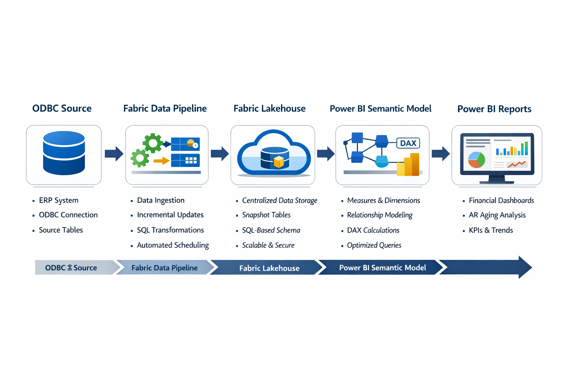

## Architecture Diagram

The following diagram illustrates the end-to-end data flow from the source ERP system through Microsoft Fabric to Power BI reporting.

**1. Source System (ODBC ERP)**
- Engineering and project data sourced from Ajera cloud ODBC
- Accessed via ODBC connector in Fabric 
- Read-only access; no operational impact to source system

**2. Microsoft Fabric Data Pipeline**
- Scheduled ingestion using Fabric Data Pipelines
- Incremental refresh logic implemented where applicable
- Basic data validation and schema alignment performed during ingestion

**3. Fabric Lakehouse**
- Centralized storage for curated analytics tables
- Data structured to support downstream BI use cases
- Replaced direct ODBC queries for improved performance and reliability

**4. Power BI Semantic Model**
- Rebuilt semantic model on top of Lakehouse tables
- Defined measures, relationships, and business logic
- Improved model maintainability and refresh stability

**5. Power BI Reports & Dashboards**
- Existing report suite re-pointed to new semantic model
- Minor visual refinements and additional report tabs added
- No regression in business-critical metrics

**6. Business Users**
- Engineering leadership and stakeholders consume reports via Power BI Service
- Improved refresh times - automatic - no human involvement
