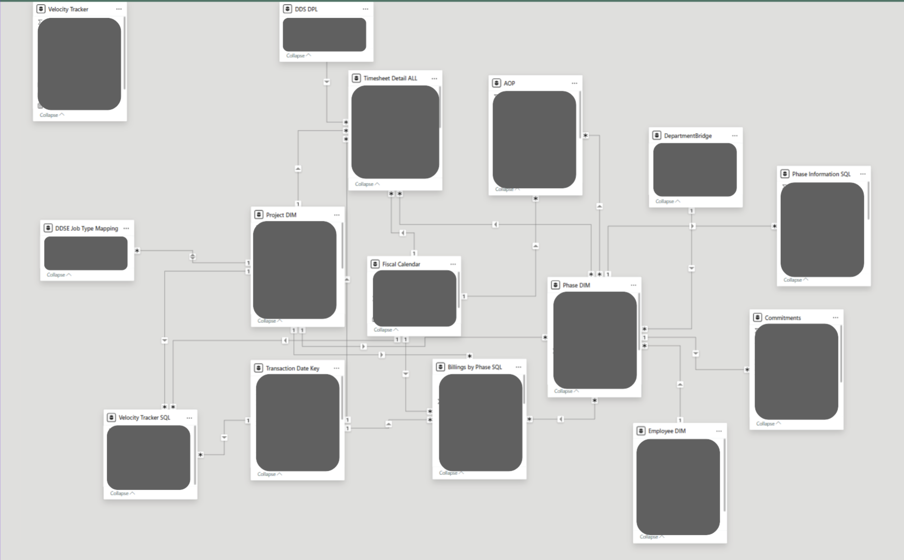

# Below is a screenshot of the Semantic Model that feeds the Power BI report suite.

### The semantic model is fed by SQL queries from the Fabric Lakehouse, Power BI Dataflows, and Excel sheets. 

- See the SQL queries folder for in-depth looks at some of the SQL queries.
